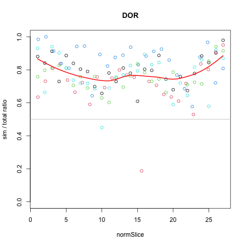
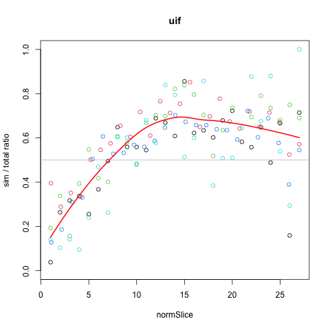
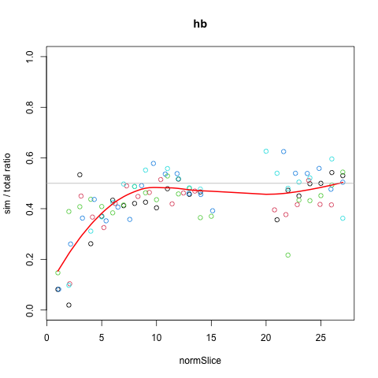
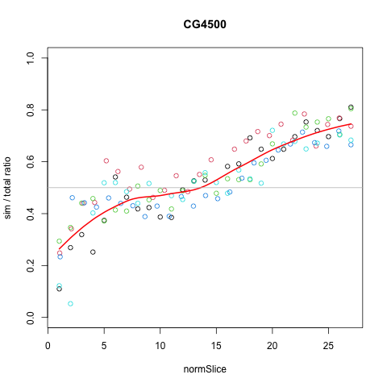

# spatialDmelxsim

Allelic counts from Combs & Fraser (2018), compiled into a
*SummarizedExperiment* object.

Package is available on Bioconductor as of August 2021:

<https://bioconductor.org/packages/spatialDmelxsim>

After the package is released in October 2021:

```
BiocManager::install("spatialDmelxsim")
suppressPackageStartupMessages(library(SummarizedExperiment))
library(spatialDmelxsim)
se <- spatialDmelxsim()
```

The assays of `se` include `a1` and `a2`. Here, `a1` assay is the *D
simulans* allelic count, `a2` assay is the *D melanogaster* allelic
count.

Data downloaded from `GSE102233` as described in the publication:

> Combs PA, Fraser HB (2018) 
> Spatially varying cis-regulatory divergence in Drosophila embryos 
> elucidates cis-regulatory logic. 
> *PLOS Genetics* 14(11): e1007631. 
> https://doi.org/10.1371/journal.pgen.1007631

## R scripts

* Script to build the *SummarizedExperiment*: `inst/scripts/make-data.R`
* Demo of loading the data and calculating allelic ratio: 
  `vignettes/spatialDmelxsim.Rmd`

## Example figures of allelic ratio (simulans / total):

See vignette for details.










